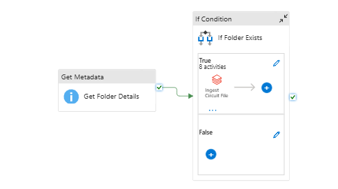
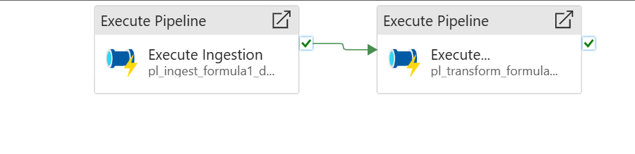
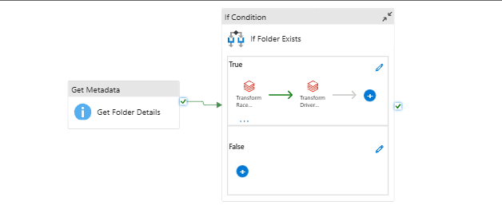
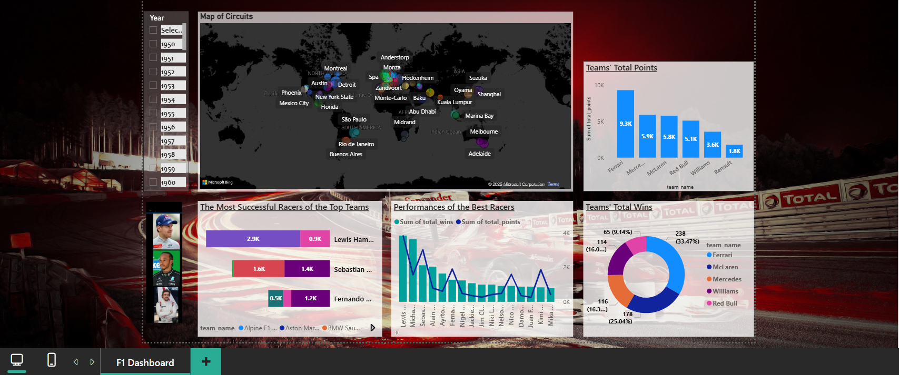
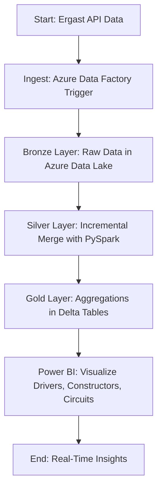

# 🚀 Formula 1 Analytics Platform – Medallion Architecture  

---

## 🌟 **Project Overview**  

**🏎️ Unleashing Formula 1 Insights with Cutting-Edge Data Engineering! 🏎️**  
*🔥 Built in July 2025, this project delivers a scalable Formula 1 analytics platform using Azure Databricks, Delta Lake, and Power BI, featuring a medallion architecture and real-time visualizations!*  

This project was developed as a **Data Engineering Showcase (July 2025)**, constructing a complete data pipeline for Formula 1 racing data. Leveraging Azure Databricks and Delta Lake on Azure Data Lake, it ingests diverse data formats (e.g., JSON, CSV) and metadata/images via APIs. Incremental loading with merge techniques, orchestrated by Azure Data Factory event-based triggers, ensures weekly race data is processed efficiently. The Gold layer powers a dynamic Power BI dashboard, offering deep insights into top drivers, constructors, circuits, wins, and points, with filters by year, decade, and overall.

---

## 📈 **Key Features** 💡  

### 🎯 Medallion Architecture
- **Bronze Layer**: Raw data ingestion from APIs (e.g., Ergast Developer API).
- **Silver Layer**: Cleaned and transformed data with incremental updates using PySpark.
- **Gold Layer**: Aggregated, enriched data for analytics, stored in Delta tables.

### 🔌 Data Pipeline
- Incremental loading with `MERGE` operations for efficiency.
- Azure Data Factory pipelines and event-based triggers detect new weekly races.
- PySpark transformations for aggregations and data enrichment.

### 🌠 Visualization
- Power BI dashboard connected to the Gold layer.
- Interactive filters for year, decade, and overall performance.
- Visualizations of top drivers, constructors, circuits, wins, and points.

### ⚡ Performance & Scalability
- Optimized with Delta Lake for ACID transactions and versioning.
- Event-driven orchestration reduces latency in data updates.
- Tested with real-world F1 data for reliability.

---

## 📷 **Visual Results**  

### Medallion Architecture Diagram
  
*Overview of the Bronze, Silver, and Gold layers in the data pipeline.*

### Azure Data Factory Pipeline for Ingestion
  
*Screenshot of the ingestion pipeline in Azure Data Factory.*

### Azure Data Factory Pipeline for Processing
  
*Screenshot of the processing pipeline in Azure Data Factory.*

### Azure Data Factory Pipeline for Transformation
  
*Screenshot of the transformation pipeline in Azure Data Factory.*

### Power BI Dashboard Snapshot
  
*Interactive dashboard visualizing F1 driver and constructor performance.*

---

## 🚀 **Technical Highlights**  

### ⚡ Robust Data Pipeline
- **Databricks Notebooks**: Python scripts for ingestion (`1.ingest_circuits_file.py`, `2.ingest_races_file.py`, etc.) and transformations (`1.race_results.py`, `2.driver_standings.py`, etc.).
- **Delta Lake**: Ensures data reliability with ACID transactions and versioning.
- **Azure Data Factory**: Orchestrates pipelines with event-based triggers for weekly race data.

### 🛡️ Data Integrity & Optimization
- Incremental loading with `MERGE` for efficient updates (`1.prepare_for_incremental_load.py`).
- PySpark for scalable data processing and aggregations.
- Delta Lake time travel for auditing and rollbacks.

### 🌍 Tools & Technologies
- **Azure Databricks**: For data engineering and PySpark processing.
- **Azure Data Lake**: Stores raw, Silver, and Gold layer data.
- **Azure Data Factory**: Manages pipeline orchestration and triggers.
- **Power BI**: Delivers rich, interactive visualizations.
- **Ergast API**: Source of F1 race data and metadata.

---

## 🎨 **Workflow Diagram**

## 🌐 Project Structure & Usage

### analysis Folder: Contains scripts for finding and visualizing dominant drivers and teams:

1.find_dominant_drivers.py: Identifies dominant drivers.
2.find_dominant_teams.py: Identifies dominant teams.
3.viz_dominant_drivers.py: Visualizes dominant drivers.
4.viz_dominant_teams.py: Visualizes dominant teams.

### images Folder: Contains project screenshots:

f1_dashboard.png: Power BI dashboard snapshot.
pl_ingest_formula1_data.png: ADF pipeline for ingestion.
pl_process_formula1_data.png: ADF pipeline for processing.
pl_transform_formula1_data.png: ADF pipeline for transformation.

### includes Folder: Contains common utilities and configuration:

common_functions.py: Shared functions.
configuration.py: Configuration settings.

### ingestion Folder: Contains scripts for data ingestion:

1.ingest_circuits_file.py: Ingests circuits data.
2.ingest_races_file.py: Ingests races data.
3.ingest_constructors_file.py: Ingests constructors data.
4.ingest_drivers_file.py: Ingests drivers data.
5.ingest_results_file.py: Ingests results data.
6.ingest_pit_stops_file.py: Ingests pit stops data.
7.ingest_lap_times_folder.py: Ingests lap times data.
8.ingest_qualifying_folder.py: Ingests qualifying data.
9.create_processed_database.py: Creates processed database.

### raw Folder: Contains scripts for raw data setup:

1.create_raw_table.py: Creates raw tables.

### set-up Folder: Contains setup scripts for access and mounting with different types of accessing:
Note: prefered one is service principal

1.access_adls_using_access_keys.py: Access ADLS with access keys.
10.mount_adls_containers_for_project.py: Mounts ADLS containers.
2.access_adls_using_sas_token.py: Access ADLS with SAS token.
3.access_adls_using_service_principal.py: Access ADLS with service principal.
4..access_adls_using_cluster_scoped_credentials.py: Access ADLS with cluster-scoped credentials.
5. explore_dbutils_secrets_utility.py: Explores dbutils secrets utility.
6. explore_dbutils_secrets_utility_SAS.py: Explores dbutils secrets for SAS.
7. explore_dbutils_secrets_utility_service_principal.py: Explores dbutils secrets for service principal.
8.explore_dbfs_root.py: Explores DBFS root.
9.mount_adls_using_service_principal.py: Mounts ADLS using service principal.

### transformations Folder: Contains scripts for data transformations:

1.race_results.py: Processes race results.
2.driver_standings.py: Calculates driver standings.
3.constructor_standings.py: Calculates constructor standings.
4.calculated_race_results.py: Calculates race results.
4.create_transformation_database.py: Creates transformation database.
f1_BI.py: BI-related transformations.

### utils Folder: Contains utility scripts:

1.prepare_for_incremental_load.py: Prepares for incremental load.

### To run:

Setup Azure Environment:

Ensure access to Azure Databricks, Data Lake, and Data Factory.
Configure Databricks cluster with PySpark and Delta Lake support.

Run Ingestion:

Deploy scripts in ingestion folder, triggered by ADF event-based trigger.

Transform Data:

Execute transformation scripts in transformations folder.

Visualize:

Use Power BI to connect to Gold layer and build the dashboard.

Screenshots of ADF pipelines and the Power BI dashboard are included in the images folder.
